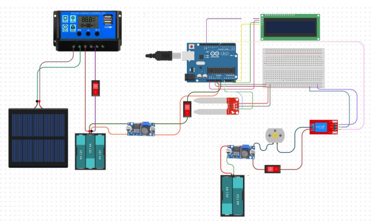

# 🌱 Solar-Powered Automatic Plant Watering System

This project is a simple automatic plant watering system powered by a 10W solar panel and an Arduino microcontroller. It uses a soil moisture sensor to detect dryness and activates a 5V DC pump to water the plants.

## 📸 Wiring Diagram

---

## 🔧 Components Used

### 🔋 Power System (Solar)
- 10W Solar Panel
- Solar Charge Controller (SCC)
- Lithium Batteries (3–4 units)
- Battery Holders (2 units)
- Switch (for solar circuit)

### 💡 Electronics & Control
- Arduino UNO (1 unit)
- 16x2 LCD (I2C or parallel)
- Jumper Wires
- Breadboard
- DC 5V Water Pump (1 unit)
- Buck Converter / Step Down Module (1 unit)
- Soil Moisture Sensor
- Switch (for manual control)
- Casing / Chassis

---

## 💡 How It Works
- The solar panel charges lithium batteries via SCC.
- Arduino reads soil moisture levels.
- If the soil is dry, the Arduino triggers a pump to water the plant.
- System runs **off-grid**, powered fully by solar energy.

---

## 🧠 Features
- 🪴 Autonomous watering using soil moisture sensor
- ☀️ Off-grid power with solar panel
- 💦 Uses 5V mini water pump for low power operation
- 🔋 Battery powered with charge control

---

## 🚀 Future Improvement Ideas
- Add RTC (Real Time Clock) to schedule watering
- Add Bluetooth or Wi-Fi monitoring
- Use an enclosure for outdoor setup

## 🙏 Catatan Penggunaan | Usage Notice

📌 **Note:**  
Proyek ini dibuat dengan tujuan edukasi dan pengembangan perangkat monitoring kesehatan.  
**Mohon untuk tidak melakukan plagiarisme atau menyalin tanpa pemahaman.**  
Jika ingin mengadaptasi, menggunakan, atau mengembangkan proyek ini, **harap mencantumkan nama pembuat: _Afriana Wardiman_**.

Silakan pelajari, modifikasi, dan kembangkan lebih lanjut dengan bijak.

📩 Jika ada pertanyaan terkait alat ini, kamu dapat menghubungi:  
**afrianawardiman19@gmail.com**

---

📌 **Note:**  
This project was created for educational and development purposes in the field of health monitoring systems.  
**Please do not plagiarize or copy without understanding.**  
If you wish to reuse, adapt, or expand upon this project, **please give proper credit to the creator: _Afriana Wardiman_**.

Feel free to study, modify, and develop it further in a responsible manner.

📩 For any questions regarding this device, you may contact:  
**afrianawardiman19@gmail.com**

---

## 📝 License

This project is open-source and available under the MIT License.
